This package provides validates you NEMO (and others) model run, computes climatologies, reduce model resolution WITHOUT REQUIRING ANY installation of tools, scripts, environments  and so on.

The catalog follows PQ-TOOL rules, just add '_T', '_U', '_V' to the experiment name as in the example file *catalog_hydroval.yaml*.

## First installation and run
Clone/download the repo on your Zeus account, filling *catalog_hydroval.yaml* and *conf.yaml* according to you needs.
As provided, the *.yamls* are set for the Black Sea domain  

Then:

*cd to_your_Clone_folder*
\
*source setup.sh* to load modules you need
\
*./hydroval* run your request

##conf.yaml
conf.yaml is the manager of the run.  Here just few details about it.

expsName: ["bs-test-int-n4.0", "bs-test-int-bdy7"] list of experiments to analyze. Here no _T,_U,_V suffix is required 

grids: ['T', 'V' , 'U']  list of grid to process. 

hvFiles_dir: output directory for intermediate files

plot_dir:  output directory for plots
pq_path: '/work/opa/sc33616/nemo/tools/bs-mfc-pq-2-refactor/runs' PLEASE CHANGE ONLY IF YOU WANT TO USE YOUR PQ

mesh_mask: path to nemo meshmask

bproject: Project queue on Zeus where your job should be submitted

###tasks block
Using T and F flag you can select your jobs

argo_profiles: T

Validation vs argo putting all the expsName in one plot. One plot per year per variable, and a cumulative plot for all the years
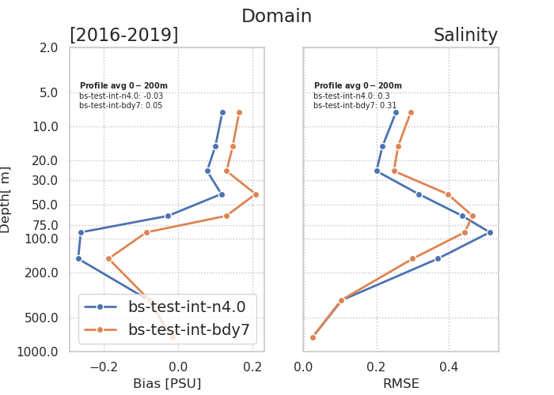

argo_errorEvolution: T

Validation vs argo putting one expsName in one plot, with 1 profile RMSE per year.
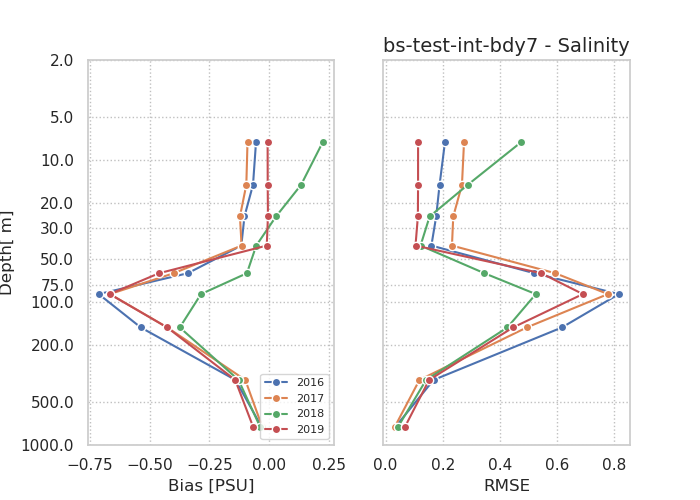

sst: T

Validation of SST vs satellite data
Production of a timeseries from *fromYear* to *toYear*.The plot includes monthly mean and daily mean 
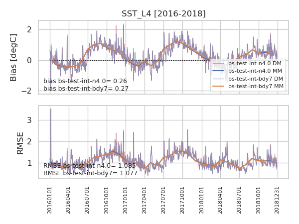
and bias-rmse map per each expName
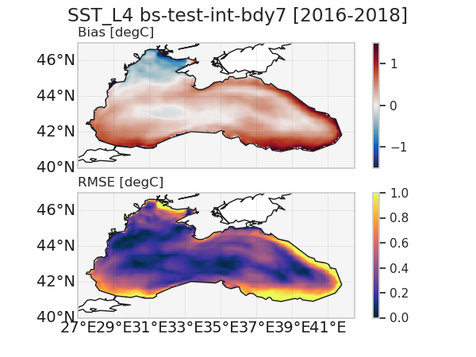
if expNames is a list of 2 experiments, the tool produces also a map of rmse difference among them

sla: T

Validation of SLA vs satellite data.
The tool produces one timeseries per year with all the experiments, and a cumulative timeseries from *fromYear* to *toYear* 
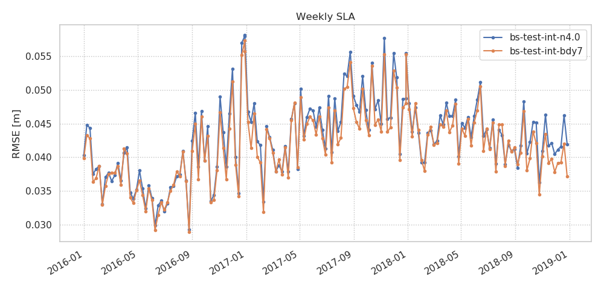

hovmoller: T

Hovmoller diagram from *fromYear* to *toYear* per experiment, per variable. You can decide to discard shallow points setting a minimum depth

anomalies:

The mean climatology is computed from *fromYear* to *toYear* 
hovmoller: T
Hovmoller anomaly diagram from *fromYear* to *toYear* per experiment, per variable. 
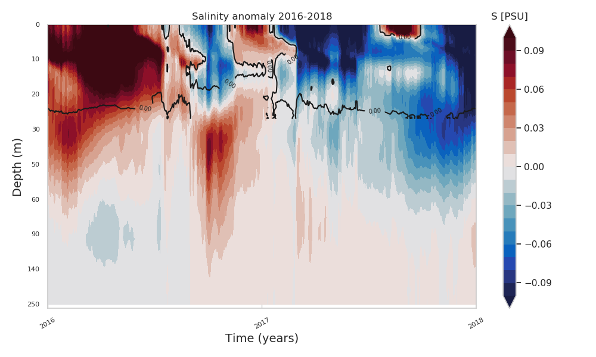

timeseries: F

Timeseries of anomaly from *fromYear* to *toYear* with all the expName. The plot includes monthly mean and yearly mean 
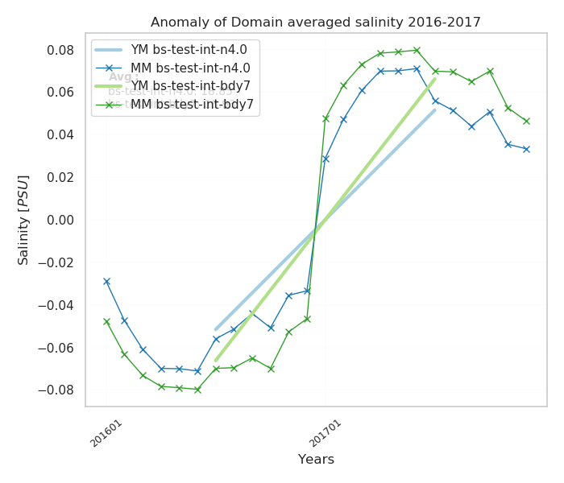

maps: F

Anomaly maps per year per variable per expName
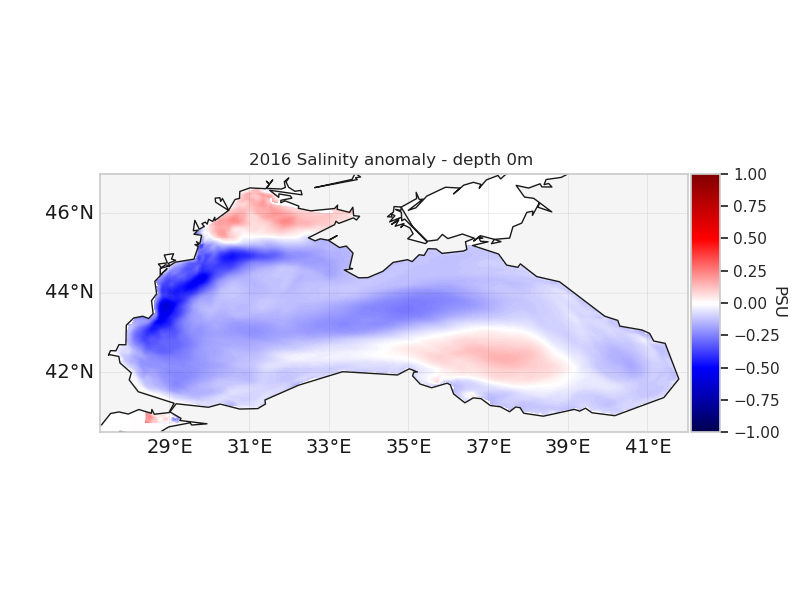

TS_diagram:

One plot per experiment, per year and a cumulative plot  from *fromYear* to *toYear*.
You can slice the dataset according to min/max depth 

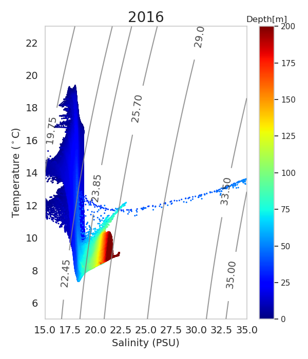

pointProfile:

TS diagram in one point. The point is specified  in coords: [PointLon, PointLat]
  -flag: F
  -coords: [31,41.5] # TS diagram in a point (x,y)

yearlyMean: F

monthlyMean: F # to be tested

timeseries:

argo: F
argo2exps: F
depthBins: F
salinityVol: F
domainAverage: F

mld: F

Mixed Layer Depth Validation vs ARGO coumputed according to density criterium.
One plot with monthly mean of mld from all the expName and observation.
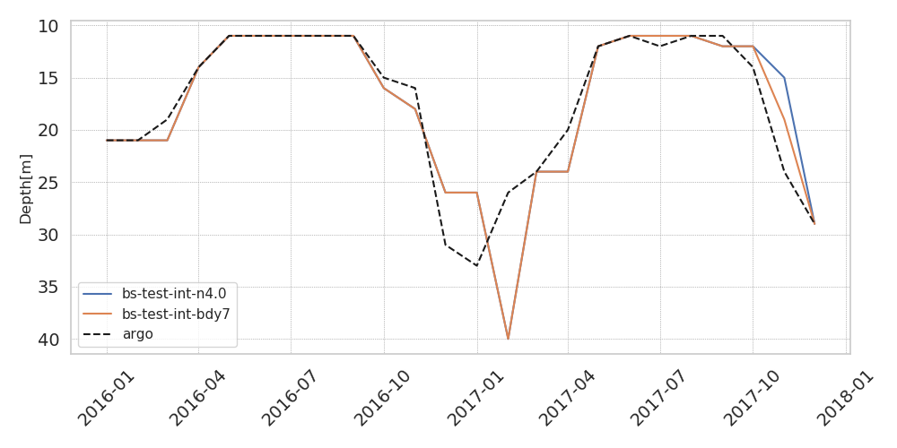

mvr_statistics: T

Some plots per experiment, per variable cumulative in time from *fromYear* to *toYear* with the same statistics provided for the Monthly Validation Report
BIAS vs ARGO

Covariance vs ARGO
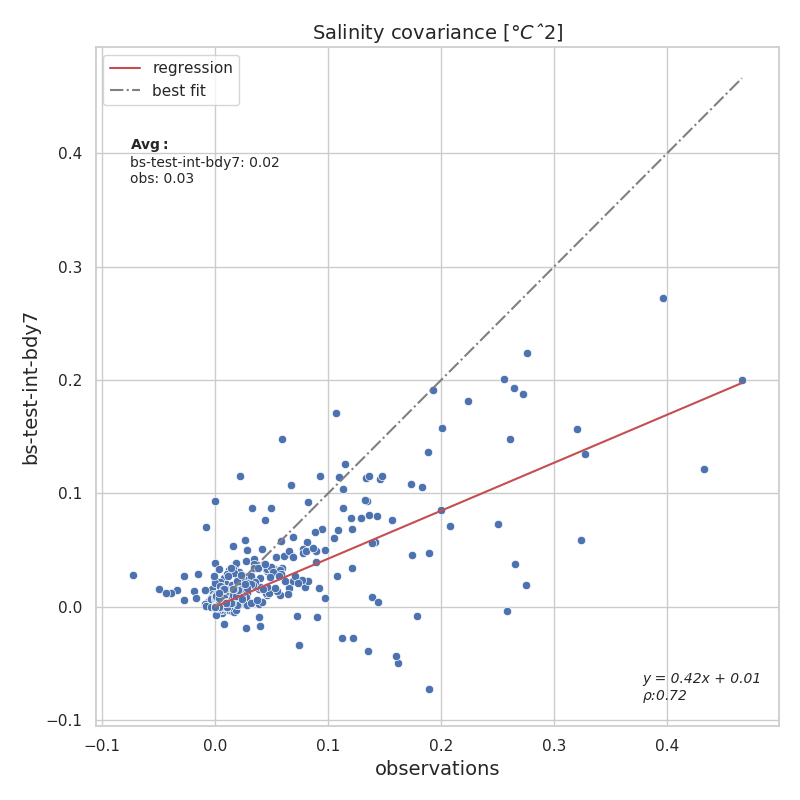
Mean of ARGO and mean of model
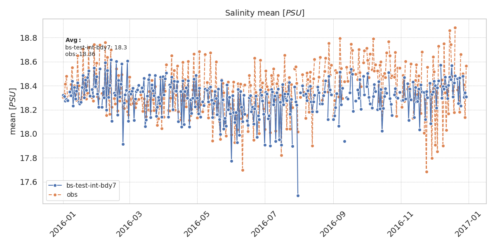
RMSE vs ARGO
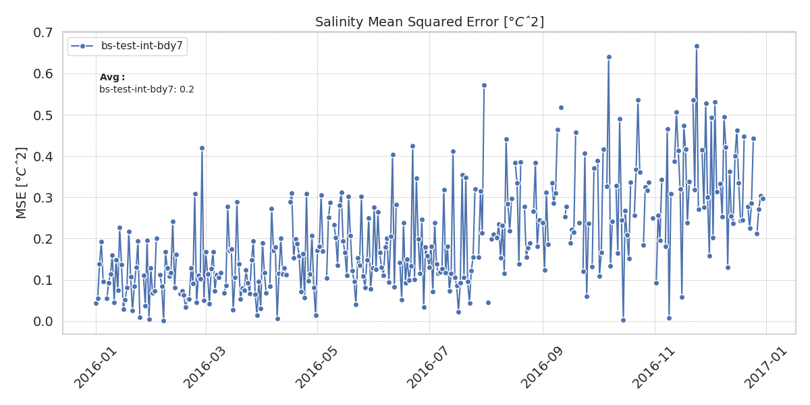
and also standard deviation and variance.

decimation:

This entry provides a dataset with reduced resolution. *decim_factor* defines how many times you want to reduce the resolution

-flag: T 

-decim_factor: 10  # Reduce resolution. N is the decimation factor

